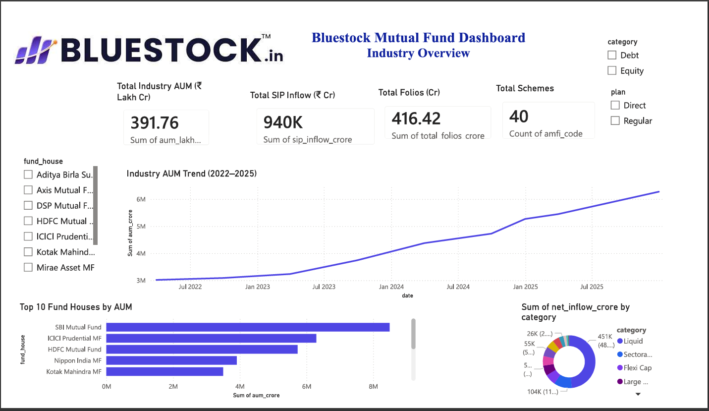
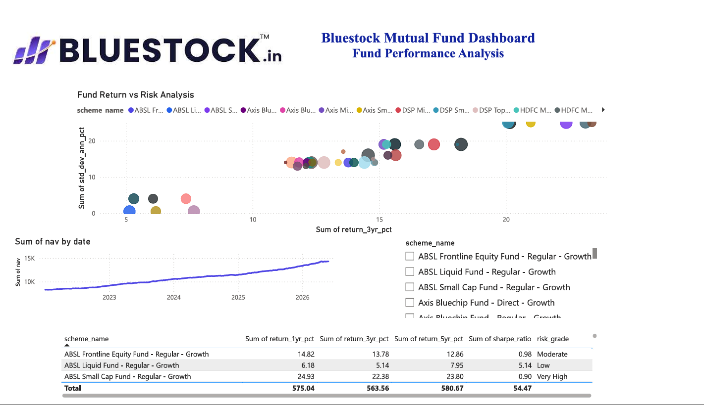
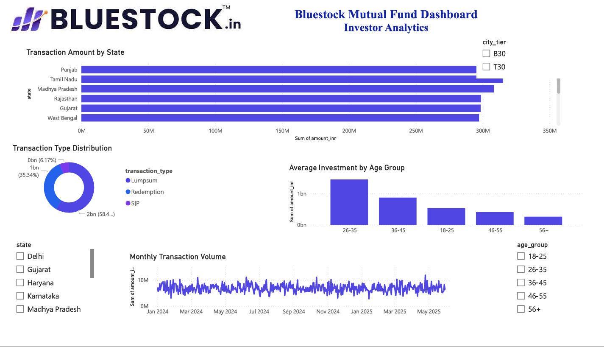
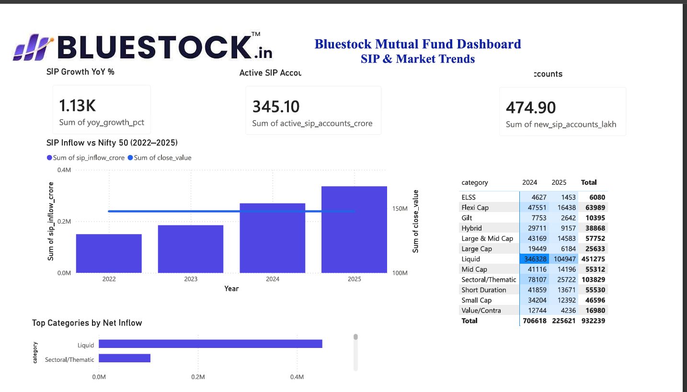

# BLUESTOCK MUTUAL FUND ANALYTICS

## End-to-End Mutual Fund Data Engineering, Analytics and Business Intelligence Solution

### Capstone Project Report

---

**Prepared By:** Sameer

**Technologies Used:**
- Python
- Pandas
- NumPy
- SQLite
- Power BI
- Matplotlib
- Jupyter Notebook
- Git & GitHub

---

## Project Duration

7-Day Mutual Fund Analytics Capstone Project

---

## Organization

Bluestock Fintech

---

## Submission Date

June 2026

# Executive Summary

The Bluestock Mutual Fund Analytics project was developed to build a complete data engineering and analytics pipeline for mutual fund analysis.

The project begins with raw mutual fund datasets and performs ingestion, cleaning, validation, transformation, exploratory data analysis, performance analytics, advanced risk analysis, and business intelligence reporting.

The solution integrates Python, SQLite, Jupyter Notebooks, and Power BI to provide meaningful insights into mutual fund performance, investor behavior, SIP trends, portfolio risk, and market benchmarks.

Key analytics performed include:

- Historical Value at Risk (VaR)
- Conditional Value at Risk (CVaR)
- Rolling Sharpe Ratio Analysis
- Investor Cohort Analysis
- SIP Continuity Risk Analysis
- Portfolio Concentration Analysis (HHI)
- Fund Recommendation System

A fully interactive Power BI dashboard was developed with drill-through capabilities and multiple analytical pages.

The final outcome provides investors and analysts with a centralized platform for evaluating mutual fund performance and risk characteristics.

# Project Objectives

The primary objectives of this project were:

1. Build a scalable mutual fund data pipeline.
2. Store and manage data using SQLite.
3. Clean and validate financial datasets.
4. Perform exploratory data analysis.
5. Calculate advanced performance metrics.
6. Conduct risk and investor behavior analysis.
7. Create an interactive Power BI dashboard.
8. Generate actionable business insights.
9. Build a fund recommendation system.
10. Maintain professional project documentation.

# Data Sources

The project uses ten datasets covering multiple aspects of mutual fund operations.

## Datasets

### 01_fund_master
Contains fund metadata including category, fund house, risk category and scheme details.

### 02_nav_history
Historical Net Asset Value (NAV) data used for return and risk calculations.

### 03_aum_by_fund_house
Assets Under Management (AUM) data grouped by fund houses.

### 04_monthly_sip_inflows
Monthly SIP inflow statistics.

### 05_category_inflows
Category-wise investment inflows.

### 06_industry_folio_count
Industry-wide folio statistics.

### 07_scheme_performance
Mutual fund return and risk performance metrics.

### 08_investor_transactions
Investor transaction records and demographic information.

### 09_portfolio_holdings
Underlying portfolio holdings and sector allocations.

### 10_benchmark_indices
Benchmark market index data including NIFTY 50.

# ETL Architecture

The project follows a structured ETL (Extract, Transform, Load) architecture to ensure data quality, consistency, and analytical readiness.

## Extract

Data was collected from ten mutual fund datasets containing fund metadata, NAV history, AUM statistics, SIP inflows, investor transactions, portfolio holdings, and benchmark indices.

## Transform

The transformation phase included:

- Missing value handling
- Duplicate removal
- Data type conversion
- Date standardization
- Outlier verification
- Data validation checks

## Load

Processed datasets were stored in SQLite and used for analytics, reporting, and Power BI dashboard creation.

## ETL Workflow

Raw Data
→ Data Cleaning
→ Validation
→ Processed Data
→ SQLite Database
→ Analytics Layer
→ Dashboard Layer

# Data Cleaning Process

Data cleaning was performed to improve data quality and reliability.

## Activities Performed

### Missing Value Treatment

Missing values were identified and handled using appropriate strategies including replacement, removal, and validation.

### Duplicate Record Removal

Duplicate records were identified and removed to prevent analytical bias.

### Data Type Standardization

Dates, numeric values, and categorical fields were converted into consistent formats.

### Validation Rules

The following validation checks were implemented:

- Unique scheme identifiers
- Valid transaction dates
- Non-negative investment amounts
- Correct fund category mapping

The cleaned datasets formed the foundation for all downstream analytics.

# Exploratory Data Analysis

EDA was conducted to understand trends, distributions, and relationships within the mutual fund ecosystem.

## Key Areas Analyzed

### Fund Distribution

Analysis of mutual funds across categories and fund houses.

### Investor Demographics

Study of investor age groups, gender distribution, income levels, and geographic locations.

### SIP Trends

Evaluation of SIP growth and contribution patterns over time.

### State-wise Investment Analysis

Comparison of transaction volumes and investment amounts across states.

EDA provided critical insights used later in dashboard development and advanced analytics.

# Key EDA Findings

## Finding 1

Gujarat emerged as one of the highest contributing states in transaction volume and investment amount.

## Finding 2

Investors in the 46–55 age group demonstrated higher average investment values compared to younger groups.

## Finding 3

SIP participation increased consistently across the observed period.

## Finding 4

Category-wise inflows revealed strong investor preference toward selected equity-oriented and thematic funds.

## Finding 5

Investor transactions showed concentration among a limited number of highly preferred schemes.

# Performance Metrics

The project calculated multiple fund performance indicators.

## Metrics Implemented

### Annual Returns

- 1-Year Return
- 3-Year Return
- 5-Year Return

### Risk Metrics

- Standard Deviation
- Maximum Drawdown
- Beta
- Alpha

### Risk-Adjusted Metrics

- Sharpe Ratio
- Sortino Ratio

These metrics enabled comprehensive evaluation of mutual fund performance.

# Advanced Analytics

Advanced analytics techniques were implemented to evaluate portfolio risk, investor behavior, and fund concentration.

## Historical VaR

Value at Risk (95%) was calculated for all mutual fund schemes.

## Conditional VaR

CVaR measured expected losses beyond the VaR threshold.

## Rolling Sharpe Ratio

A rolling 90-day Sharpe ratio was calculated to evaluate changing risk-adjusted performance over time.

## Investor Cohort Analysis

Investors were grouped according to their first transaction year.

## SIP Continuity Analysis

Investors with gaps greater than 35 days between SIP transactions were classified as At-Risk.

## Portfolio Concentration Analysis

Herfindahl-Hirschman Index (HHI) was calculated to measure portfolio concentration levels.

# Power BI Dashboard Overview

A comprehensive Power BI dashboard was developed to transform analytical results into interactive visualizations.

The dashboard enables users to:

- Monitor mutual fund industry trends
- Analyze fund performance
- Evaluate investor behavior
- Track SIP growth
- Assess risk metrics
- Access drill-through fund details

The dashboard consists of five analytical pages designed for different stakeholder perspectives.

# Dashboard Page 1 – Industry Overview

This page provides a high-level summary of the mutual fund industry.

## Key Components

- Total Industry AUM
- Total SIP Inflows
- Total Folios
- Total Schemes
- Industry AUM Trend
- Top Fund Houses by AUM
- Category Distribution Analysis

## Business Value

Provides a quick understanding of overall industry growth and market structure.

## Dashboard Screenshot

# Dashboard Page 2 – Fund Performance

This page focuses on evaluating mutual fund performance and risk.

## Key Components

- Risk vs Return Scatter Plot
- NAV Trend Analysis
- Fund Performance Table
- Scheme Selection Filters
- Risk Metrics Comparison

## Business Value

Helps investors identify high-performing funds while understanding associated risk levels.

## Dashboard Screenshot

# Dashboard Page 3 – Investor Analytics

This page analyzes investor behavior and demographic trends.

## Key Components

- State-wise Transaction Analysis
- Investor Age Group Analysis
- Transaction Type Distribution
- Monthly Transaction Volume
- City Tier Analysis

## Business Value

Provides insights into investor participation patterns and regional investment trends.

## Dashboard Screenshot

# Dashboard Page 4 – SIP & Market Trends

This page evaluates SIP growth and market relationships.

## Key Components

- SIP Inflow vs NIFTY50 Trend
- Active SIP Accounts
- New SIP Accounts
- Category Inflow Heatmap
- Top Categories by Net Inflow

## Business Value

Highlights investor confidence and market participation trends.

---

# Dashboard Page 5 – Fund Details

This page provides drill-through fund-level analytics.

## Key Components

- Fund Information
- Return Metrics
- Sharpe Ratio
- Risk Grade
- Fund House Information
- Detailed Performance Metrics

## Business Value

Allows detailed evaluation of individual mutual fund schemes.

## Dashboard Screenshot

# Key Insights

## Insight 1

Fund AMFI 119599 recorded the highest downside risk based on VaR analysis.

## Insight 2

Fund AMFI 101207 demonstrated the highest tail-risk exposure according to CVaR calculations.

## Insight 3

The 2024 investor cohort represented the majority of investment activity with 4,803 investors.

## Insight 4

A total of 1,332 investors were classified as At-Risk due to irregular SIP contributions.

## Insight 5

Axis Bluechip Fund – Regular – Growth recorded the highest portfolio concentration based on HHI analysis.

# Recommendations

Based on the analytical findings, the following recommendations are proposed:

1. Monitor funds with elevated VaR and CVaR values.
2. Encourage investor engagement programs for At-Risk SIP investors.
3. Promote portfolio diversification strategies.
4. Utilize risk-adjusted performance metrics for fund selection.
5. Implement automated monitoring of SIP continuity and investor retention.

# Limitations

The project was conducted using the available datasets and therefore has certain limitations.

- Results depend on dataset completeness.
- Market conditions may change over time.
- Historical performance does not guarantee future returns.
- Some investor behavior patterns may evolve beyond the analysis period.
- Portfolio holdings represent a snapshot in time.

# Future Enhancements

Future versions of the project may include:

- Real-time NAV integration
- Live market feeds
- Predictive analytics using machine learning
- Portfolio optimization models
- Investor churn prediction
- Automated reporting systems
- Cloud-based deployment

# Conclusion

The Bluestock Mutual Fund Analytics Capstone successfully delivered an end-to-end analytics platform integrating data engineering, financial analytics, risk assessment, and business intelligence.

The project demonstrates the practical application of Python, SQL, Power BI, and financial analytics techniques to generate meaningful insights from mutual fund datasets.

Through advanced risk analysis, investor behavior evaluation, and interactive dashboarding, the solution provides a valuable decision-support framework for investors, analysts, and financial institutions.

The project successfully achieved all planned objectives and established a strong foundation for future enhancements and real-world deployment.